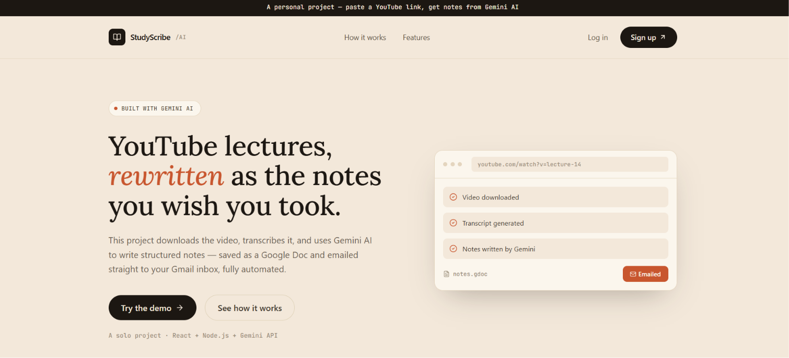
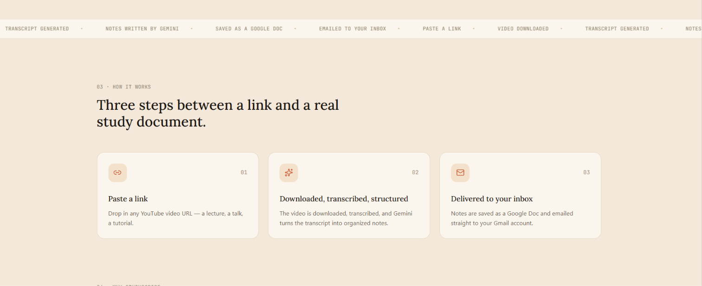
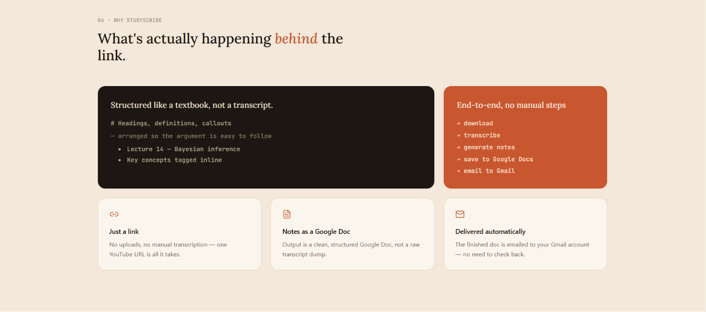
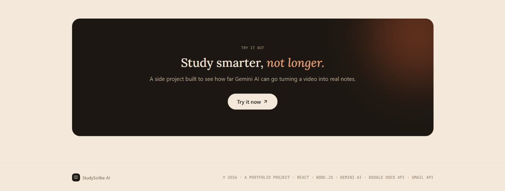
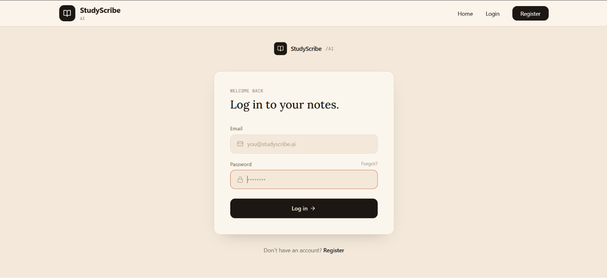
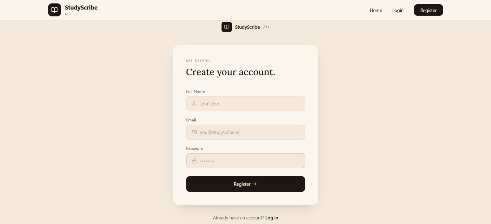
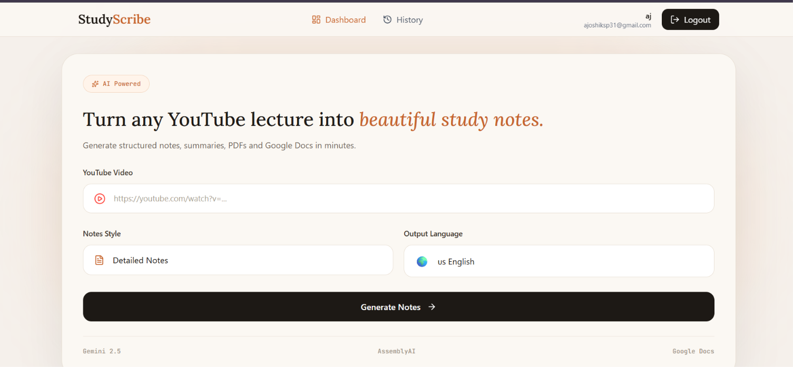
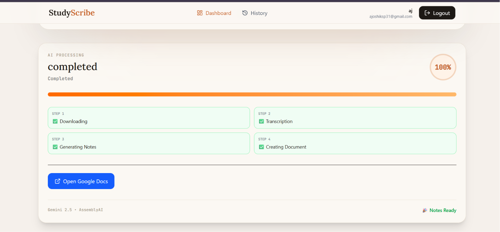
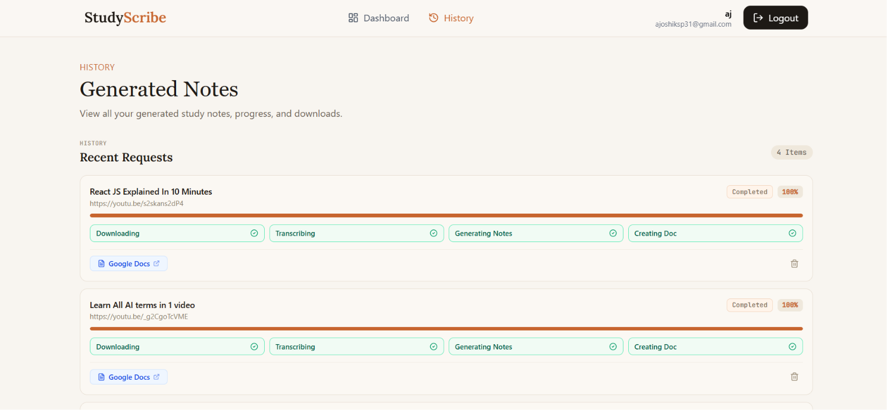
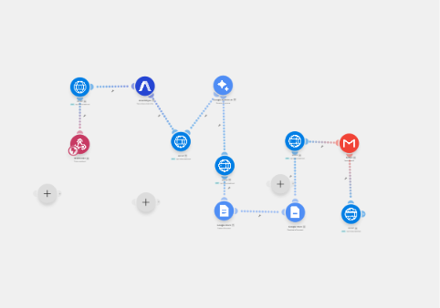

# 📚 StudyScribe AI

StudyScribe AI is an AI-powered web application that converts YouTube lectures into structured study notes. Simply paste a YouTube URL, and the application transcribes the video, then uses Gemini to generate structured notes with headings, key concepts, and examples.

---

## ✨ Features

- 🎥 Convert YouTube videos into study notes
- 🤖 AI-generated notes using Gemini
- 📝 Structured notes with headings and subheadings
- 📌 Key concepts extraction
- 🌍 Supports English, Hindi, and Roman Hindi (Hinglish)
- 📑 Export to Google Docs
- 📧 Notes automatically emailed as a PDF to the user's Gmail
- 🔐 User authentication
- 📊 Dashboard to manage generated notes

> Note: some features below are in active development — see **Future Improvements**.

---

## 🛠️ Tech Stack

### Frontend
- React
- React Router
- Tailwind CSS
- Lucide React Icons
- Axios

### Backend
- Node.js
- Express.js
- MongoDB
- Mongoose
- JWT Authentication
- Cloudinary (hosts the downloaded audio so it's reachable by URL)

### AI & APIs
- Google Gemini API
- AssemblyAI

### Automation
- Make (Integromat) — orchestrates the pipeline from transcription through Gemini, Google Doc/PDF creation, and Gmail delivery
- Google Docs API
- Gmail API

---

## 📂 Project Structure

```
StudyScribe-AI/
│
├── backend/
│   ├── src/
│   │   ├── config/
│   │   ├── controllers/
│   │   ├── downloads/
│   │   ├── middleware/
│   │   ├── models/
│   │   ├── routes/
│   │   ├── services/
│   │   ├── utils/
│   │   ├── app.js
│   │   └── server.js
│   ├── .env
│   ├── testDownload.js
│   └── package.json
│
├── frontend/
│   ├── public/
│   ├── src/
│   │   ├── assets/
│   │   ├── components/
│   │   ├── context/
│   │   ├── hooks/
│   │   ├── pages/
│   │   ├── services/
│   │   ├── utils/
│   │   ├── App.css
│   │   └── App.jsx
│   └── package.json
│
|
└── README.md/
```

---

## 🚀 Workflow

```
User
   │
   ▼
Paste YouTube URL (on React frontend)
   │
   ▼
Express backend downloads audio
   │
   ▼
Express backend uploads audio to Cloudinary (generates public URL)
   │
   ▼
Backend triggers Make (Integromat) via Webhook, passing the Cloudinary URL
   │
   ▼
Make (Integromat) handles the rest:
   │
   ├──▶ AssemblyAI transcribes audio from Cloudinary URL
   │
   ├──▶ Gemini generates structured notes from transcript
   │
   ├──▶ Create Google Doc (via Google Docs API)
   │
   ├──▶ Convert Doc to PDF
   │
   └──▶ Email PDF to user's Gmail (via Gmail API)
   │
   ▼
Make sends result back to Express backend
   │
   ▼
Backend saves notes/status to MongoDB
   │
   ▼
Display in Dashboard
```

> ⏳ **Processing time depends on video length.** Downloading, transcribing, and generating notes for a short video takes a couple of minutes, but a long video (e.g. a ~2 hour lecture) can take significantly longer to fully process, since transcription and note generation both scale with video duration. There's currently no real-time progress indicator — see **Future Improvements**.

---

## 📸 Screens

## Landing Page






## Login Page


## Register page


## Dashboard



## History Page


## Make.com Automation

The automation pipeline:

Backend → Webhook → AssemblyAI → Gemini → Google Docs → PDF → email → Callback




## Demo


---

## ⚙️ Installation

### Clone the repository
```bash
git clone https://github.com/harshitajoshi04/studyscribe-ai.git
```

### Install Frontend
```bash
cd frontend
npm install
npm run dev
```

### Install Backend
```bash
cd backend
npm install
npm run dev
```

---

## 🔑 Environment Variables

Create a `.env` file inside the `backend` folder.

```env
PORT=5000
MONGODB_URI=
JWT_SECRET=
JWT_EXPIRE=
CLIENT_URL=
WEBHOOK_SECRET=
CLOUDINARY_CLOUD_NAME=
CLOUDINARY_API_KEY=
CLOUDINARY_API_SECRET=
```

---

## 🧠 What I Learned

Early on, notes generated by Gemini were coming back with every heading rendered at the same size in the exported document — no visual hierarchy at all. The root cause was that the AI's output was plain text with structural markers explicitly stripped out to avoid stray symbols. The fix was to have Gemini return clean semantic HTML (`<h1>`, `<h2>`, `<ul>`, etc.) instead of plain text, so the export step could map those tags to real heading styles. It reinforced that formatting needs to travel as structured data between systems — not be reconstructed after the fact from plain prose.

---

## 🎯 Future Improvements

- ⚡ Background job queue with real-time progress updates, so long videos (e.g. 2+ hour lectures) show live status instead of a long silent wait
- 🗂️ Flashcards for revision
- ⏱️ Timestamped notes
- 📄 In-app PDF preview before emailing
- AI Quiz Generator
- Mind Maps
- MCQ Generator
- Dark Mode
- Note Sharing
- AI Chat with Notes
- Voice Notes
- Mobile Application
- Offline Downloads

---

## 👨‍💻 Author

Harsha

---

## 📄 License

This project is licensed under the MIT License.